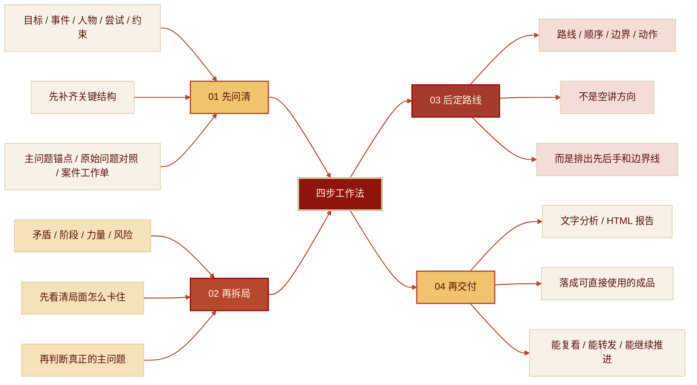

<div align="center">

<p></p>

<p><em>“最近大家都在蒸馏各种 skill。但，蒸馏的最终目的，是要<strong>能够解决问题！</strong>”</em></p>

<p><em><strong>新青年来中国是能解决问题，会解决问题的！</strong></em></p>

<p>
  <a href="./LICENSE"></a>
  <a href="https://claude.ai/code"></a>
  <a href="https://openai.com/"></a>
  <a href="https://agentskills.io"></a>
</p>

<br>

<p>把《毛泽东选集》蒸馏成一个真能拆现实问题的 skill。</p>

<p>
  不是语录复读机，不是高压话术生成器，也不是“主要矛盾”四个字到处乱扣帽子。<br>
  他只干一件正事：<strong>先把问题一步一步梳理清楚，再把局面拆开，最后给出能往前推的判断和动作。</strong>
</p>

<br>

<p>你可以把他理解成，把<strong>“新中国最会解决问题的脑子”</strong>请来，当一次“临时参谋”。</p>

<br>

<br>

<p><em>原“<strong>毛选拆局.Skill</strong>”，因名字太过敏感，现更名为“新青年.Skill”</em></p>
<br>

<p>
  <a href="#安装">安装</a> ·
  <a href="#使用">使用</a> ·
  <a href="#适用场景">适用场景</a> ·
  <a href="#输出结果">输出结果</a> ·
  <a href="#边界">边界</a> ·
  <a href="#仓库结构">仓库结构</a>
</p>

<p>
  <a href="https://samadhifire.github.io/xinqingnian-maoxuan-skill/examples/%E7%BB%84%E7%BB%87%E5%88%86%E5%8F%89%E6%A1%88%E4%BE%8B%E6%8A%A5%E5%91%8A.html">
    
  </a>
</p>

</div>

---


## 他适合谁

更适合这类“<strong>表面像摩擦，底层其实是结构问题</strong>”的局面：

- **项目推进卡住**：项目推进不动，人人都在忙，但关键结果就是不动。
- **多人关系拉扯**：合伙人、同事、上下级之间互相拉扯，信息不透明，责任不清楚。
- **团队协同错位**：表面像执行差，实质是路线、阶段和控制点没对齐。
- **关系边界混乱**：表面像情绪冲突，背后其实是边界、资源、第三方和旧账。
- **重大选择难下**：你在纠结换工作、止损、继续谈还是直接掀桌，但脑子里还是一锅粥。

一句话：

**他擅长的不是“答题”，而是“拆局”。**

## 他和普通“毛选风格 Prompt”有什么不同

不是把语言换成“毛选口吻”，而是把处理问题的方法换掉了：

1. **不抢答**：先调查，再判断，不装一眼看穿全局。
2. **不空喊**：不堆大词，重点是主要矛盾、阶段、力量、路线和风险。
3. **不跳步**：先锁目标，再补澄清，再拆主问题，不靠模型自己“记住”。
4. **不悬空**：不只分析，最后会落到路线、顺序和下一步动作，而不是停在一段气势很足的话。
5. **不只给文字**：除了文字版分析，还能生成可保存、可分享的单文件 **HTML 报告**。

## 他怎么工作

这不是“你一句，我输出八段”的技能，而是一套四步工作法：

> **先问清，再拆局；先定线，再交付。**



一句话：

**先把题目看对，再把局面拆开，最后才谈怎么动手。**

## 他的适用场景

它更适合这类“表面像摩擦，底层其实是结构问题”的局面：

<table>
  <tr>
    <td width="50%" valign="top">

**工作推进**  
项目卡点 / 资源分配 / 跨团队协作 / 执行失灵

常见感受：人人都在忙，但关键结果就是不动。

  </td>
    <td width="50%" valign="top">

**团队治理**  
角色混乱 / 机制失效 / 权责不清 / 反馈回路断裂

常见感受：表面像执行差，实质是规则、接口和控制点没对齐。

  </td>
  </tr>
  <tr>
    <td width="50%" valign="top">

**关系边界**  
伴侣 / 朋友 / 合伙人 / 上下级之间的长期拉扯

常见感受：话说了很多，关系却越谈越乱。

  </td>
    <td width="50%" valign="top">

**自我管理**  
状态波动 / 节奏失控 / 长期目标和现实能力脱节

常见感受：不是不想推进，而是总在关键节点掉链子。

  </td>
  </tr>
  <tr>
    <td colspan="2" valign="top">

**生活决策**  
换工作 / 分手 / 合作 / 止损 / 继续投入还是撤退

常见感受：不是缺建议，而是脑子里线头太多，分不清先看哪根。

  </td>
  </tr>
</table>

一句话：

**越像“结构题”，越适合用它来拆。**


## 他的使用方式

### 最简单的触发方式

把 skill 装好后，直接说这些都行：

- `用毛选帮我分析这个项目为什么推进不动`
- `用教员的方法拆一下我和合伙人的关系`
- `用新青年帮我分析一下这个项目为什么越推越卡`
- `按新青年的方法拆一下我现在这个团队的问题`
- `用毛选来帮我梳理这个问题`


### 想让结果更准，最好顺手给这五样

- `目标`：你最想推进的结果是什么
- `事件`：最近一次最说明问题的关键事件
- `人物`：关键人物、第三方、关系人分别是谁
- `尝试`：你已经做过什么
- `约束`：你现在真正的限制、底线和代价

### 一个好用的提问模板

```text
请用毛选拆局的方法帮我分析这件事。

我的目标：
最近关键事件：
涉及人物：
我已经做过的尝试：
我的现实约束：

先别急着下结论，如果信息不够请先追问我。最后帮我输出一份HTML报告。
```

以下是参考示例，请在使用时候，尽量提供清晰完整的背景信息（很重要很重要！！！）：

```text
请用毛选拆局的方法帮我分析一下我现在这个团队的问题。

最近一两个月，我越来越感觉团队表面上还在正常运转，但很多原来默认有效的规则已经开始失灵了。比如会上说好的分工，会后经常各干各的；有些事名义上有人负责，真出了问题又没人接；同一件事经常会出现两个口径，下面的人也不知道到底该听谁的。上周还有一次比较典型：一个项目明明会上已经过了一遍，结果到临近交付才发现两个小组理解完全不一样，中间也没人把关键变化同步清楚。

我现在最想先弄明白的，不是立刻拿一套整改方案，而是先判断这到底更像节奏问题、角色边界问题，还是其实真实规则已经变了，只是没有人明说。

先别急着下结论，如果信息不够请先追问我。最后帮我输出一份HTML报告。”。
```

## 他的输出结果

### 1. 文字版深度分析

适合先把局面看明白。通常会包括：

- 问题重述
- 核心判断
- 当前阶段
- 推荐路线
- 风险提醒
- 下一步动作

但在进入这一步之前，如果输入还模糊，系统应先做一轮选项式澄清，而不是直接下判断。
如果用户给了聊天记录、微信片段或局部措辞，默认也先把它们当证据材料，而不是立刻下沉成“帮你写一句怎么发”。

### 2. 单文件 HTML 报告

适合保存、复盘、转发，复杂问题还可以带上：

- 时间线
- 关系图
- 路线比较
- 证据链
- 控制点分布
- 执行计划

这类报告不是把长文原样搬进网页，而是把“核心判断 -> 关系结构 -> 建议路线 -> 证据与控制点 -> 方法出处”排成一份可以直接复看和转发的单文件成品。

下面这组预览只展示几个关键模块，不追求完整，只负责让人一眼看出这份 HTML 报告是什么样子。


#### 示例报告完整版
<p>
  <strong>复杂组织分叉案例：</strong>
  <a href="https://samadhifire.github.io/xinqingnian-maoxuan-skill/examples/%E7%BB%84%E7%BB%87%E5%88%86%E5%8F%89%E6%A1%88%E4%BE%8B%E6%8A%A5%E5%91%8A.html">
    
  </a>
</p>

#### 示例报告预览

**1. 封面与总判断**  
先用一屏把问题场景、阶段、服务对象和当前推荐路线压住。

<p align="left">
  
</p>

**2. 关系图模块**  
先看谁影响谁、谁卡谁、谁依赖谁，再进入路线判断。

<p align="left">
  
</p>

**3. 建议路线区**  
把当前主路线、成立前提、支点和关键动作压成一屏。

<p align="left">
  
</p>

**4. 下一步行动与证据链**  
一边给出近期动作和观察点，一边交代“为什么这样判断”。

<p align="left">
  
</p>

**5. 控制点分布表**  
把名义归属和现实掌握方拆开，说明谁在改写口径、责任和边界。

<p align="left">
  
</p>

**6. 人物与关系清单**  
补充各方诉求、态度、依赖和合作边界，不让关系图只停在“谁连着谁”。

<p align="left">
  
</p>

**7. 结构拆解与路线比较**  
把主次问题拆开，再把几条路线放在一起比较，不让判断停在一句口号上。

<p align="left">
  
</p>

**8. 方法出处与结论压缩**  
最后交代这份判断是从哪些方法来的，并用一句话收住结论。

<p align="left">
  
</p>


## 他不适合谁

这个 skill 不适合下面几种用法：

- 只想摘毛选原文，不想分析现实问题
- 只想学几句“主要矛盾在于你不听话”这种吓人的台词
- 拿方法论给别人扣帽子、压人、操控关系
- 问题本身很轻，用普通常识建议就够了
- 纯技术实现细节问题，不涉及结构判断和路线设计

一句话：

**别把方法论玩成气势道具。**

## 安装方式

### Claude Code

Claude Code 会从项目里的 `.claude/skills/`，或全局的 `~/.claude/skills/` 读取 skill。

```bash
# 安装到当前项目（在你的项目根目录执行）
mkdir -p .claude/skills
git clone https://github.com/SamadhiFire/xinqingnian-maoxuan-skill.git .claude/skills/xinqingnian-maoxuan-skill

# 或安装到全局（所有项目都能用）
git clone https://github.com/SamadhiFire/xinqingnian-maoxuan-skill.git ~/.claude/skills/xinqingnian-maoxuan-skill
```

### Codex

如果你在用 Codex，一般放进 `$CODEX_HOME/skills/` 或 `~/.codex/skills/` 即可。

```bash
git clone https://github.com/SamadhiFire/xinqingnian-maoxuan-skill.git ~/.codex/skills/xinqingnian-maoxuan-skill
```

### 其他平台

不是每个平台都叫 skill，但大多数 agent 平台都会支持“自定义系统提示词 / 自定义技能目录 / 项目级规则”。

最省事的用法（大部分平台都很聪明了）：

**霸气地告诉你的Agent！：**

```bash
请帮我接入这个 skill：
https://github.com/SamadhiFire/xinqingnian-maoxuan-skill

按 README 进行安装；如果当前平台不支持 skill，就转换成自定义规则。
```

## 仓库结构

```text
xinqingnian-maoxuan-skill/
├── .editorconfig                          # UTF-8 / LF 编辑器约束
├── .gitattributes                         # Git 行尾规则
├── README.md                              # 项目介绍、安装方式、HTML 预览
├── LICENSE                                # MIT 许可
├── SKILL.md                               # 主入口
├── agents/
│   └── openai.yaml                        # Codex skill UI 元数据
├── examples/
│   ├── 验收样例集.md                    # 首轮/追测验收样例
│   ├── 组织分叉案例输入.md                # 输入样例
│   ├── 组织分叉案例报告.html              # HTML 报告样例
│   ├── 模糊输入首轮澄清示例.md            # 首轮澄清示例
│   └── screenshots/                       # README 预览截图
├── references/
│   ├── categories/                        # 问题分类
│   ├── clarification/                     # 澄清与重述
│   ├── html-output/                       # HTML 输出规范
│   ├── methods/                           # 方法卡
│   ├── risks/                             # 误用边界与红线
│   ├── routing/                           # 输出路由
│   └── scenarios/                         # 场景入口
└── scripts/
    └── quick_validate.py                  # 本地 UTF-8 安全校验脚本
```


## 最后一句

这不是教你背《毛选》。

这是把《毛选》蒸馏成一套今天还能用来拆现实问题、推进现实行动的工具。

新青年来中国是能解决问题，会解决问题的！

---

## Star History

<p align="center">
  <a href="https://www.star-history.com/#SamadhiFire/xinqingnian-maoxuan-skill&Date">
    
  </a>
</p>

<p align="center">
  <strong>如果这个项目对你有帮助，欢迎给仓库点个 Star。</strong>
</p>
